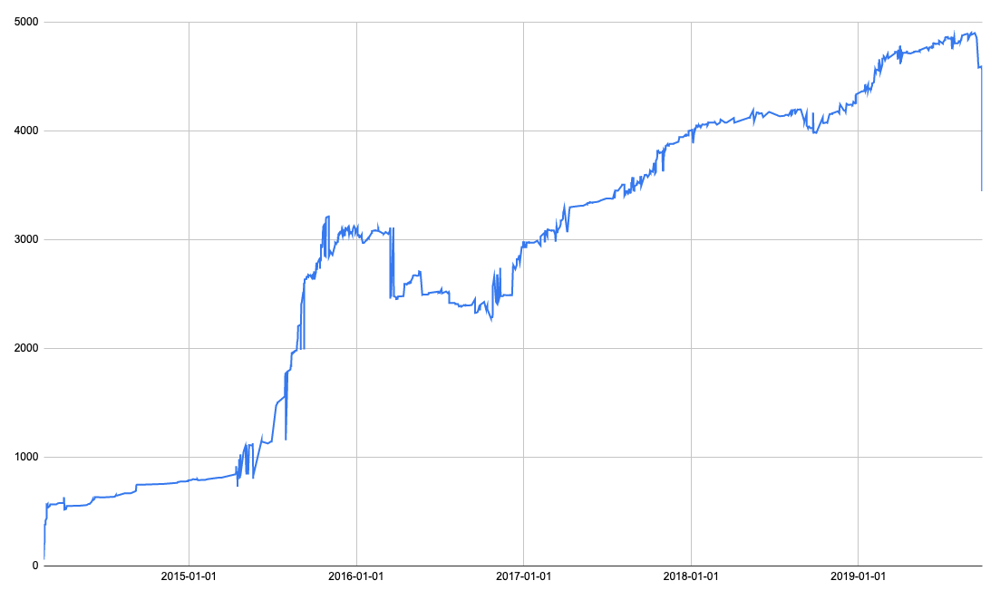

# git file line count history

This is a simple script to track how the size of a specific file in a git repository changed across time. Useful to track big files as their logic gets extracted into smaller ones.

Beware this is not counting [SLOCs](https://en.wikipedia.org/wiki/Source_lines_of_code), but just raw line breaks. However, this should be enough to give you rough but good estimates of file size as it progresses through time.

## Requirements

- bash
- Node.js (tested with v12.11.0, but should work with the Node.js you have installed, whatever it is)

## How to run

A summary of what the script does:

- lists all commits that contain a change to the given file, including those containing the file but on a different name (i.e., it tracks renames)
- for each commit found, the script checks what was the file size at that point
- the script keeps track of the file size and then prints it to the output together with other commit information

The first step is accomplished by `commit-history.sh`. Copy it to the root folder of the git repo, and run it passing as argument the name of the file whose changes are to be tracked. For example:

    ./commit-history.sh src/main/java/com/foo/Bar.java

The name of the file must be the name being used by the most recent commit that has it. The script will track file changes back in time and will detect renames. The output will be something like this:

```
commit d0248c3ea62d65daa6260cc4ed575c8483340f4a
author Lucio Paiva
date 2019-09-28
message some commit msg

src/main/java/com/foo/Bar.java
commit 7178a553c6ee91b1556e6afd051eab3a7efbcb04
author Lucio Paiva
date 2019-09-28
message bla bla bla

src/main/java/com/foo/Bar.java
...
```

An output file (`commit-history.txt`) will be created following the pattern above. Pass it as a parameter to `commit-history.js`:

    node commit-history /path/to/commit-history.txt

The final output will be something like this:

```
2014-02-18	58	1138d022174c2bb1f8bf9a4381ff629b0ffad5fc	some commit message
2014-02-18	71	7aa50f38e5083da3aa2dc04ae61433c613701c06	another commit msg
2014-02-18	76	78834d79dbca8b201a6018051bc9fcb007d3febf	bla bla bla
2014-02-18	79	21b3b4dc02b7e54cb260bbeb5d562f0c49d7817b	bob loblaw
2014-02-19	197	2c57b954470a9cc714b313fb51cd8bec66b92ff8	foo bar
2014-02-19	197	5af1f0ae30c6804fcff37158953bd31cf61c1d3d	whatever
2014-02-19	203	e3b1b871ed35cfbe143806c4c5fc953d11c0ca6b	another commit
```

Where values are tab-separated. This output can be easily fed into a spreadsheet program like Google Sheets, where it can be plotted (first column should be the horizontal axis, second column the vertical axis).



## Technical discussion

My initial approach was to use `--numstat`, which gives how many lines were added/removed per commit, and then accumulate the changes across commits. I first used:

    git log --date=short --follow --numstat --no-color --date-order --reverse -- <path-to-file> > numstat.txt

The option `--reverse` is important to start from the first commit, otherwise accumulating increments won't give you the correct line count.

But the first problem with that approach is that it doesn't track file name changes. If you changed the name of the file at some point, those commits with the other name won't appear in the output. Not to despair, though; just add the option `--follow`, which will track file renaming. The only problem now is that you usually know the current file name, but not its name when it first appeared in a commit. So I decided to remove the `--reverse` option and the revert it in my script and only then accumulate line counts. New approach:

    git log --pretty=format:"commit %H%nauthor %aN%ndate %ad%nmessage %s" --date=short --follow --numstat --no-color --date-order -- <path-to-file>

This also changes formatting a bit to make it easier for the parser.

But that doesn't work either. I found out that things go wrong when there are concurrent changes to the file in parallel branches. They may be touching the same lines, so just accumulating the line changes will give you the wrong line count. Every time there's branching, the accumulated error increases. After thousands of commits parsed, the line count gets badly wrong. That's why I gave up with this approach the try the one I'm currently using.
